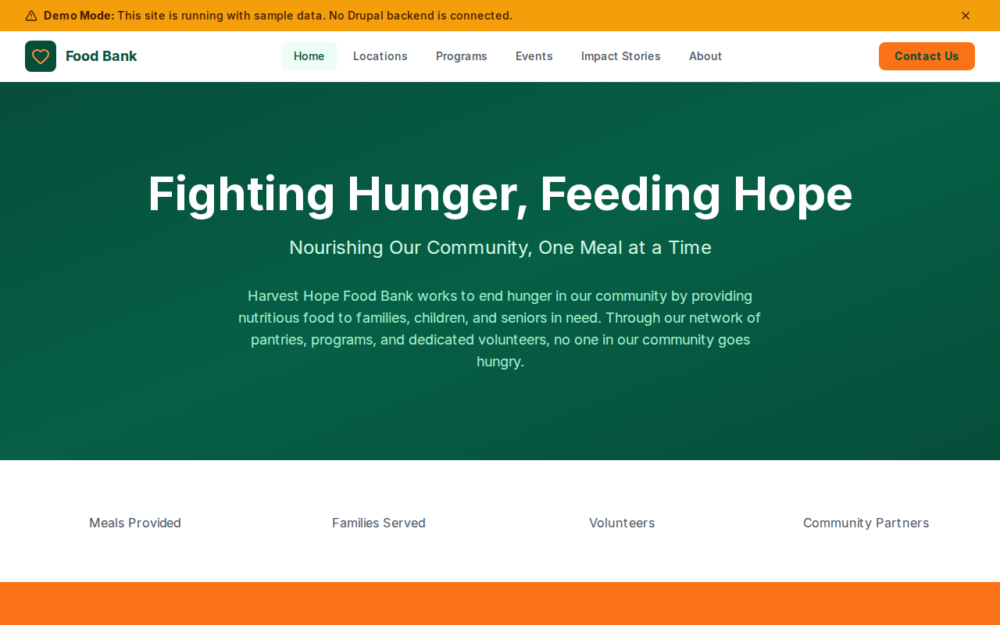

# Decoupled Food Bank

A community food bank website built with Next.js and Decoupled Drupal, designed for food banks, pantries, and hunger relief organizations to manage distribution locations, programs, events, and impact stories.



[](https://vercel.com/new/clone?repository-url=https://github.com/nicholasio/decoupled-food-bank&project-name=decoupled-food-bank)

## Features

- Display food pantry and mobile **distribution locations** with hours, addresses, and service areas
- Showcase hunger relief **programs** like Backpack Buddies, senior nutrition, and job training
- Promote food drives, volunteer days, and fundraiser **events** with dates and volunteer needs
- Share **impact stories** from clients, volunteers, and community partners
- Dynamic homepage with hero section, statistics, and donation call-to-action

## Quick Start

### 1. Clone the template

```bash
npx degit nicholasio/decoupled-food-bank my-food-bank
cd my-food-bank
npm install
```

### 2. Run interactive setup

```bash
npm run setup
```

### 3. Start development

```bash
npm run dev
```

Visit [http://localhost:3000](http://localhost:3000)

---

## Manual Setup

<details>
<summary>Click to expand manual setup steps</summary>

### Authenticate with Decoupled.io

```bash
npx decoupled-cli@latest auth login
```

### Create a Drupal space

```bash
npx decoupled-cli@latest spaces create "Harvest Hope Food Bank"
```

Note the space ID returned (e.g., `Space ID: 1234`). Wait ~90 seconds for provisioning.

### Configure environment

```bash
npx decoupled-cli@latest spaces env 1234 --write .env.local
```

### Import content

```bash
npm run setup-content
```

This imports the following sample content:

- **Locations:** Main Warehouse & Distribution Center, Northside Community Pantry, Mobile Market (rotating locations)
- **Programs:** Backpack Buddies Weekend Food Program, Golden Harvest Senior Nutrition Program, Community Kitchen Job Training
- **Events:** Spring Community Food Drive, Volunteer Sort Day, Harvest Gala 2026
- **Impact Stories:** The Martinez Family (client), Riverside Tech Partnership (partner), Tom Henderson - 10,000 Hours (volunteer)
- **Pages:** About Harvest Hope Food Bank, Get Help - Find Food Near You
- **Homepage:** Hero section, statistics (4.2M Meals, 38,000 Families, 5,200 Volunteers, 180 Partners), and donation CTA

</details>

## Content Types

### Distribution Location

Food pantry and distribution site locations.

| Field | Type | Description |
|-------|------|-------------|
| address | string | Street address |
| phone | string | Contact phone number |
| hours | text | Hours of operation |
| location_type | term(location_types)[] | Type of location |
| serves_area | string | Geographic service area |
| image | image | Location photo |
| body | text | Full description and details |

### Program

Food bank programs and initiatives.

| Field | Type | Description |
|-------|------|-------------|
| program_type | term(program_types)[] | Category of program |
| eligibility | text | Eligibility requirements |
| schedule | string | Program schedule |
| contact_phone | string | Program contact number |
| image | image | Program photo |
| body | text | Full program description |

### Event

Food drives, volunteer events, and fundraisers.

| Field | Type | Description |
|-------|------|-------------|
| event_date | datetime | Start date and time |
| end_date | datetime | End date and time |
| location | string | Event venue or area |
| event_type | term(event_types)[] | Category of event |
| volunteers_needed | integer | Number of volunteers needed |
| image | image | Event photo |
| body | text | Event details |

### Impact Story

Stories of how the food bank has made a difference.

| Field | Type | Description |
|-------|------|-------------|
| story_category | term(story_categories)[] | Story type |
| featured | bool | Whether to feature prominently |
| image | image | Story photo |
| body | text | Full story text |

### Homepage

Landing page with hero section, statistics, and call-to-action areas.

| Field | Type | Description |
|-------|------|-------------|
| hero_title | string | Hero headline |
| hero_subtitle | string | Hero subheading |
| hero_description | text | Hero body text |
| stats_items | paragraph(stat_item)[] | Key statistics |
| featured_items_title | string | Featured section title |
| cta_title | string | CTA section title |
| cta_description | text | CTA body text |
| cta_primary | string | Primary button label |
| cta_secondary | string | Secondary button label |

### Taxonomies

- **Location Types:** Main Warehouse, Community Pantry, Mobile Distribution, School Pantry, Senior Center
- **Program Types:** Emergency Food, Youth Programs, Senior Programs, Nutrition Education, Community Kitchen
- **Event Types:** Food Drive, Volunteer Day, Fundraiser, Community Distribution, Workshop
- **Story Categories:** Client Stories, Volunteer Spotlights, Partner Highlights, Community Impact

## Customization

### Colors & Branding

Edit `tailwind.config.js` to customize colors, fonts, and spacing for your food bank's brand.

### Content Structure

Modify `data/food-bank-content.json` to update locations, programs, events, and other sample content.

### Components

React components are in `app/components/`. Update them to match your organization's design and branding.

## Demo Mode

### Enable Demo Mode

Set the environment variable:

```bash
NEXT_PUBLIC_DEMO_MODE=true
```

Or add to `.env.local`:

```
NEXT_PUBLIC_DEMO_MODE=true
```

### What Demo Mode Does

- Shows a "Demo Mode" banner at the top of the page
- Returns mock data for all GraphQL queries
- Displays sample locations, programs, events, and impact stories
- No Drupal backend required

### Removing Demo Mode

To convert to a production app with real data:

1. Delete `lib/demo-mode.ts`
2. Delete `data/mock/` directory
3. Delete `app/components/DemoModeBanner.tsx`
4. Remove `DemoModeBanner` from `app/layout.tsx`
5. Remove demo mode checks from `app/api/graphql/route.ts`

## Deployment

### Vercel (Recommended)

[](https://vercel.com/new/clone?repository-url=https://github.com/nicholasio/decoupled-food-bank)

Set `NEXT_PUBLIC_DEMO_MODE=true` in Vercel environment variables for a demo deployment.

### Other Platforms

Works with any Node.js hosting platform that supports Next.js.

## Documentation

- [Decoupled.io Docs](https://www.decoupled.io/docs)
- [Next.js Documentation](https://nextjs.org/docs)
- [Drupal GraphQL](https://www.decoupled.io/docs/graphql)

## License

MIT
